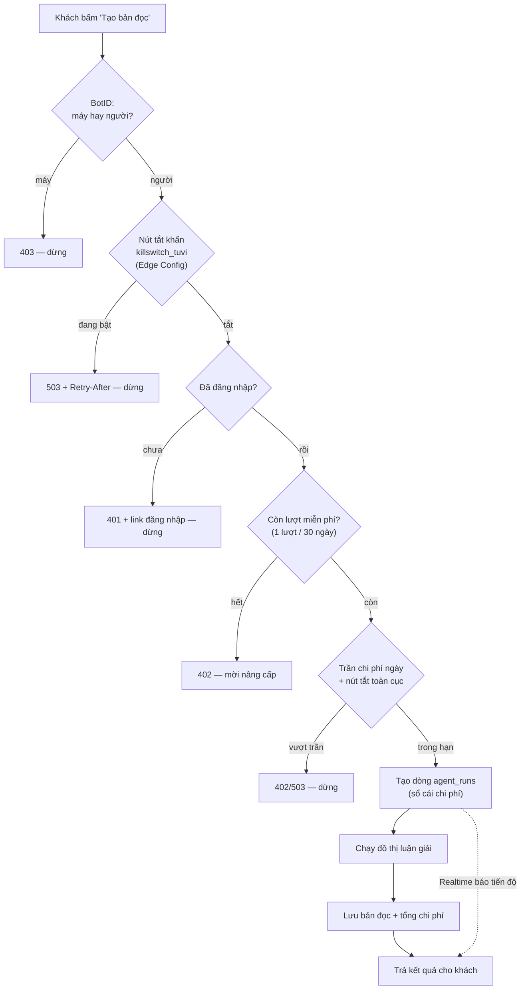
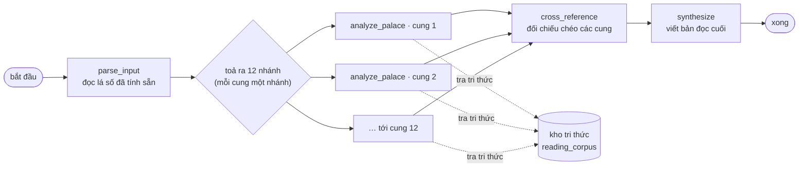
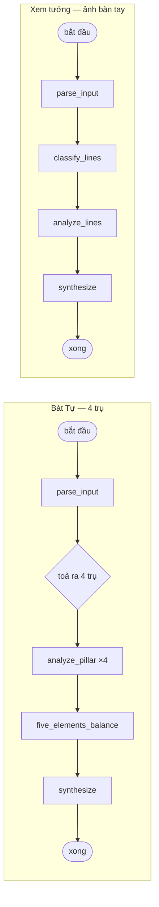
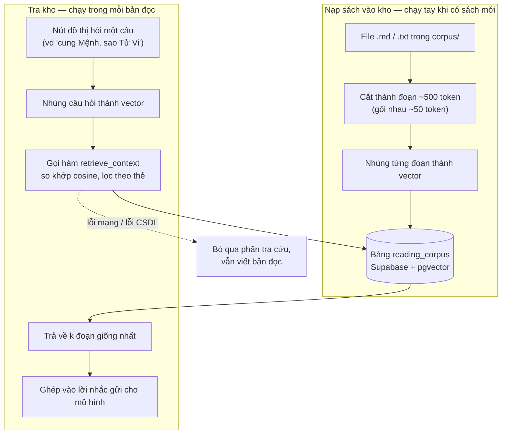

# Sơ đồ luồng: luận giải AI & tra cứu tri thức

Hai luồng "đắt tiền" nhất của hệ thống trước đây chỉ được mô tả bằng chữ, rải rác trong
comment đầu file. Tài liệu này vẽ lại chúng thành sơ đồ để người mới (và người cũ sau vài
tháng) nhìn một cái là biết dữ liệu đi đâu, tiền tiêu ở chỗ nào, và cửa chặn nằm ở đâu.

Sơ đồ dùng cú pháp Mermaid — GitHub, VS Code và hầu hết trình đọc Markdown đều tự vẽ.

Nguồn sự thật là code; nếu sơ đồ lệch code thì code đúng:

- `apps/web/src/app/api/reasoning/tu-vi/full/route.ts` — cửa vào + các cửa chặn
- `apps/web/src/lib/reasoning/tu-vi-graph.ts` — đồ thị Tử Vi (12 cung)
- `apps/web/src/lib/reasoning/bat-tu-graph.ts` — đồ thị Bát Tự (4 trụ)
- `apps/web/src/lib/reasoning/palm-graph.ts` — đồ thị Xem tướng
- `apps/web/src/lib/reasoning/rag.ts` — tra cứu tri thức
- `apps/web/src/lib/reasoning/cost-guard.ts` + `runtime-config.ts` — trần chi phí, nút tắt
- `apps/web/src/lib/edge-config.ts` — nút tắt theo từng tính năng, chế độ bảo trì

---

## 1. Luồng luận giải — từ lúc bấm tới lúc ra bản đọc

Điểm cần nhớ: có **bốn cửa chặn xếp trước mọi lời gọi AI**. Không cửa nào chặn thì tiền
mới bắt đầu tiêu.

### Đồ thị Tử Vi — 12 cung chạy song song

Một cung lỗi **không** làm hỏng cả bài: phần của cung đó thành rỗng và bước đối chiếu chéo
tự xử lý chỗ trống. Chỉ `parse_input` và `synthesize` là hai bước bắt buộc phải thành công.

### Hai đồ thị còn lại (cùng khuôn, ít nhánh hơn)

### Tiền tiêu ở đâu (ước tính một bản đọc Tử Vi)

| Bước | Bậc mô hình | Ước tính |
| --- | --- | --- |
| Tra tri thức (12 lần nhúng) | embedding | ~0,0002 USD |
| Phân tích 12 cung | bậc giữa | ~0,48 USD |
| Đối chiếu chéo | bậc giữa | ~0,06 USD |
| Viết bản đọc cuối | bậc cao | ~1,20 USD |
| **Tổng** | | **~1,74 USD** |

Mỗi bước tự cộng dồn chi phí vào dòng `agent_runs`, nên số liệu trên chỉ là ước tính để
đặt trần — số thật luôn đọc từ sổ cái.

---

## 2. Luồng tra cứu tri thức (RAG)

Có hai nửa tách rời nhau: nạp sách vào kho (chạy tay, thỉnh thoảng) và tra kho (chạy trong
mỗi bản đọc).

Nguyên tắc quan trọng: **tra cứu hỏng thì bản đọc vẫn ra**, chỉ kém giàu dẫn chứng hơn.
Người gọi bắt lỗi và đi tiếp, không để một lỗi tra cứu chặn cả bài.

Chỉ hàm `retrieve_context` được mở ra ngoài; bảng `reading_corpus` không cấp quyền đọc
trực tiếp cho khách.

---

## 3. Các nút vặn khi có sự cố

Tất cả đọc từ Vercel Edge Config, đổi là có hiệu lực trong ~30 giây, **không cần deploy lại**:

| Khoá | Tác dụng |
| --- | --- |
| `killswitch_tuvi` | Tắt riêng luồng Tử Vi (đắt nhất), Bát Tự và Xem tướng vẫn chạy |
| `killswitch_mentor` | Tắt trò chuyện với Mentor |
| `maintenance_mode` | Chặn toàn site, mọi trang chuyển sang `/maintenance` |
| `reasoning.killSwitch` | Tắt toàn bộ luồng luận giải |
| `reasoning.capUsdPerDayAuthed` | Trần chi phí mỗi ngày cho một tài khoản |
| `reasoning.tierOverride` | Ép mọi lời gọi xuống bậc mô hình rẻ |
